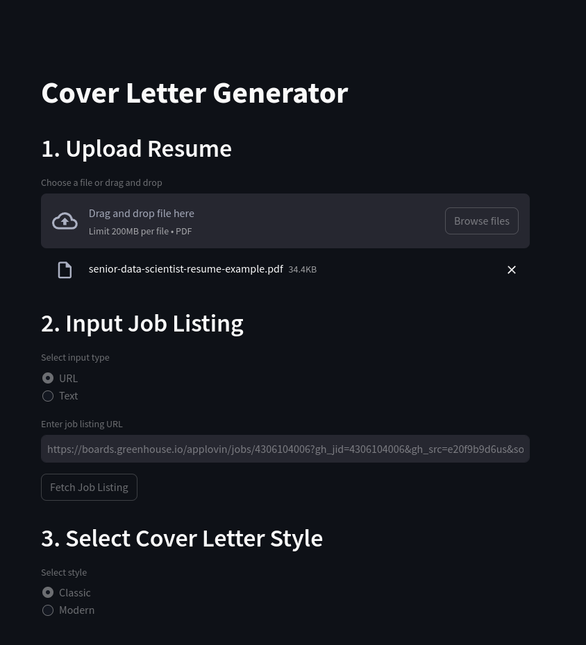
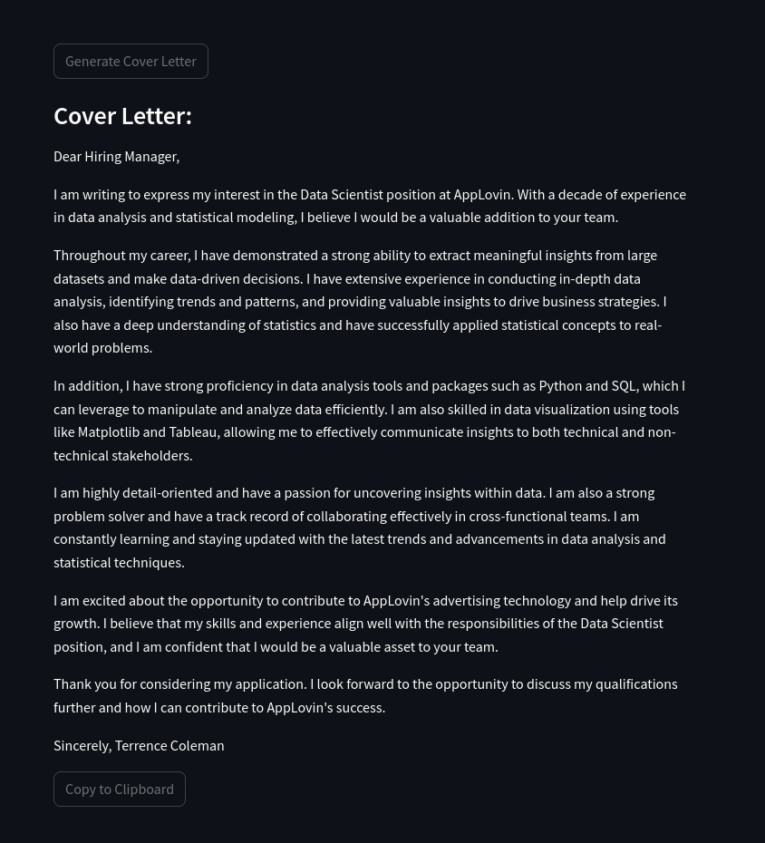

# Cover Letter LLM Generator

## Introduction

This repository contains a Cover Letter Generator App which was created as part of the interview process at ALMA (https://www.tryalma.ai/). The project took approximately 4-5 hours to complete, with around 3 hours dedicated to creating backend and UI, and an additional 1-2 hours for fine-tuning the prompt to optimize results.

## LLM Powered
The LLM used is `gpt-3.5-turbo` for its cost-effectiveness and impressive capabilities at the given price range.  
Local models were avoided due to a lack of available compute resources. However, the design through LangChain allows for easy switching to alternative models.
The repo contains two main prompts, each designed with detailed instructions focusing on a different style of cover letter. These prompts can easily be modified or expanded to include additional styles.

## Steps

1. **Upload Resume:**
   - Allows the user to upload a resume in PDF format. The resume is then converted to text using the `pypdf2` library.

2. **Input Job Listing:**
   - Allows the user to input a job listing URL or text. A simple LLM based scraper is used to extract the relevant job description and company information from the URL.
     - Note: For websites which are hard to scrape, please use the text option to enter the job description manually.

3. **Style Selector:**
   - Allows the user to select a style of cover letter, determining which prompt will be used to generate the cover letter.
     - The `Classic` style is designed to be a more traditional cover letter with a suitable length and tone.
     - The `Modern` style is designed to be a more concise cover letter with a more casual tone.

4. **Generate Cover Letter:**
   - Generates a cover letter based on the selected style and the provided resume and job listing. The generated cover letter is displayed in the UI and can be easily copied to the clipboard.

## How to Run

### Prerequisites

Make sure you have [Poetry](https://python-poetry.org/) installed.

### Clone the Repository

```bash
git clone https://github.com/DoubleGremlin81/cover-letter-llm.git
cd cover-letter-llm
```

### Create a `.env` File

```bash
echo "OPENAI_API_KEY=<your-openai-api-key>" >> .env
```

### Build the Docker Container

```bash
docker build -t cover-letter-llm .
```

### Run the Application

```bash
docker run --env-file .env cover-letter-llm
```

## Screenshots





## Examples
### Example 1
Resume: [Resume](assets/senior-data-scientist-resume-example.pdf)  
Job Listing: [Job Listing](https://boards.greenhouse.io/applovin/jobs/4306104006)

#### Classic Cover Letter
Dear Hiring Manager,

I am writing to express my interest in the Data Scientist position at AppLovin. With a decade of experience in data analysis and statistical modeling, I believe I would be a valuable addition to your team.

Throughout my career, I have demonstrated a strong ability to extract meaningful insights from large datasets and make data-driven decisions. I have extensive experience in conducting in-depth data analysis, identifying trends and patterns, and providing valuable insights to drive business strategies. I also have a deep understanding of statistics and have successfully applied statistical concepts to real-world problems.

In addition, I have strong proficiency in data analysis tools and packages such as Python and SQL, which I can leverage to manipulate and analyze data efficiently. I am also skilled in data visualization using tools like Matplotlib and Tableau, allowing me to effectively communicate insights to both technical and non-technical stakeholders.

I am highly detail-oriented and have a passion for uncovering insights within data. I am also a strong problem solver and have a track record of collaborating effectively in cross-functional teams. I am constantly learning and staying updated with the latest trends and advancements in data analysis and statistical techniques.

I am excited about the opportunity to contribute to AppLovin's advertising technology and help drive its growth. I believe that my skills and experience align well with the responsibilities of the Data Scientist position, and I am confident that I would be a valuable asset to your team.

Thank you for considering my application. I look forward to the opportunity to discuss my qualifications further and how I can contribute to AppLovin's success.

Sincerely, Terrence Coleman

#### Modern Cover Letter
Hi, I'm Terrence Coleman, an analytically minded self-starter with a decade of experience collaborating with cross-functional teams to ensure data accuracy and integrity. I have a strong background in data analysis, statistical expertise, and data visualization using tools like Python and SQL. I have successfully led teams and implemented predictive modeling to drive business efficiency and strategic goals. I am excited about the opportunity to join AppLovin as a Data Scientist and apply my skills to analyze large datasets, uncover insights, and provide valuable recommendations to drive the advertising technology forward. With my strong analytical and problem-solving abilities, attention to detail, and effective communication skills, I am confident that I would be a great fit for this role. I look forward to the opportunity to contribute to AppLovin's success. Thank you for considering my application.


### Example 2
Resume: [Resume](assets/senior-data-scientist-resume-example.pdf)  
Job Listing: [Job Listing](https://jobs.lever.co/Grid/6d7c0bcb-61ff-415f-9aa0-c6750b66754f)

#### Classic Cover Letter
Dear Hiring Manager,

I am excited to apply for the Staff Data Scientist position at Grid. With my decade of experience in data science and analytics, I am confident that I can make a significant impact on Grid's progress and contribute to the success of its users.

In my current role as a Senior Data Scientist at Best Buy, I have led data extraction and evaluation efforts, resulting in cost savings of over 11M. I have also partnered with the product team to build a production recommendation engine in Python, which generated $450K in incremental annual revenue. These experiences demonstrate my ability to collaborate with cross-functional teams and deliver actionable insights.

Furthermore, my experience at 2U as a Data Scientist and Data Analyst has honed my skills in A/B testing, data extraction, and modeling. I have successfully optimized algorithms to target the learning audience by 15% and increased profitability by 4% through Python clustering methods.

With my proficiency in Python, SQL, and machine learning techniques, I am well-equipped to develop and validate models that align with Grid's strategic objectives. Additionally, my understanding of the financial industry, gained through building and scaling FinTech products, will enable me to contribute domain knowledge to the team.

I am eager to join Grid and help build out the data science team and practice. I am confident that my analytical mindset, autonomy, and curiosity make me the ideal candidate for this role. Thank you for considering my application.

Sincerely, Terrence Coleman

#### Modern Cover Letter
Hi, I'm Terrence Coleman, an analytically minded self-starter with a decade of experience in data science and analysis. I have a strong background in statistical inference and machine learning, which aligns well with Grid's need for a Staff Data Scientist. In my current role at Best Buy, I led data extraction efforts and built a recommendation engine that resulted in increased revenue. Additionally, I developed customer attrition models and improved monthly retention. My experience at 2U allowed me to optimize algorithms and improve learning platforms through A/B testing. I have also worked extensively with Python, SQL, and Excel to extract and analyze data. With my expertise in data science, autonomy, and domain knowledge in the financial industry, I believe I would be a great fit for Grid's team. I am excited to contribute to Grid's mission of leveling the financial playing field and would love the opportunity to further discuss how my skills and experience can benefit your company. Thank you for considering my application.
